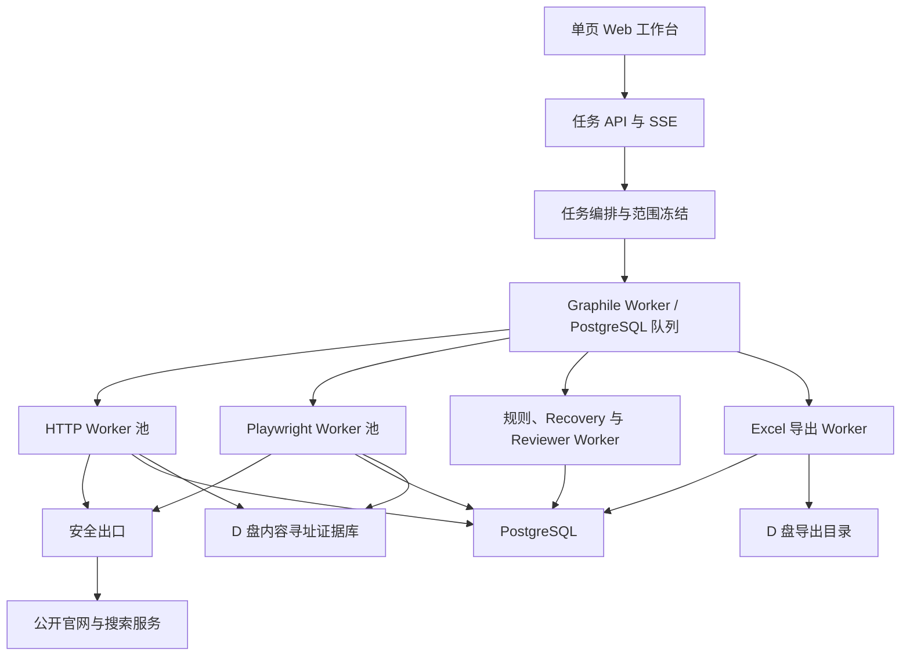
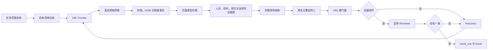

# 全国行政区官员岗位信息 URL 爬虫系统设计规格

> 文档状态：用户已整体批准；实施计划阶段暂停，等待用户另行授权
>
> 设计日期：2026-07-30
>
> 项目目录：`E:\Stellaris`
>
> 需求来源：`official-biography-evidence` Skill 与本轮 Superpowers brainstorming 决议
>
> 决策审计日志：`docs/superpowers/brainstorming/2026-07-30-official-biography-crawler-decision-log.md`

## 1. 摘要

本项目把 `official-biography-evidence` 中适用于自动化系统的证据、准入、Recovery、Reviewer 和 Excel 规则，改装为一个真正的 Web 爬虫系统。

系统面向本地单用户，按需批量采集中国省、地市、区县及可选乡镇/街道官方网站中的官员个人简介信息 URL。核心能力不是通用网页下载，而是：

1. 冻结行政区与机构范围；
2. 快速发现当前领导入口；
3. 自适应选择 HTTP、Playwright 或经验证的公开接口；
4. 从页面结构中组装完整领导班子；
5. 按机构类型选出两名主要自然人；
6. 只允许五类官方岗位信息页面进入候选；
7. 对空 URL、禁止页面、冲突与遗漏执行改变策略的 Recovery；
8. 通过独立网络复抓完成 Reviewer 盲审；
9. 从同一份已复核结果生成网页表格和单 Sheet Excel。

系统采用纯规则判断，不把大模型放进页面判型、选人或最终 URL 准入链。找不到合格 URL 时必须留空，不使用新闻、媒体、百科、搜索结果或栏目首页补位。

## 2. 产品目标

### 2.1 首版目标

- 支持一次任务选择多个行政区。
- 支持从上级行政区自动展开下级行政区。
- 支持用户取消部分下级地区。
- 支持上传指定行政区名单。
- 默认展开到区县，可选择继续展开到乡镇和街道。
- 支持完整机构清单模式和指定机构/人员模式。
- 支持暂停、继续、取消、失败重试和容器重启后的恢复。
- 任务开始后 30 秒内开始返回已复核结果。
- 对已知候选 URL 的 100–300 页面多域名批次，P95 在 60 秒内完成。
- 输出简洁网页表格与一个单 Sheet Excel。
- 所有最终 URL 都可追溯到真实网络事件、页面证据、规则版本和 Reviewer 决策。

### 2.2 非目标

首版不包含：

- 全国全量一键持续监控；
- 定时任务和变更订阅；
- 登录、团队、角色、权限和多租户；
- 公网 SaaS 运营；
- 人工逐条审核队列；
- 通用爬虫可视化编排器；
- 任前公示、代理任命、选举任命和离任 URL 采集；
- 新闻、舆情、媒体或百科人物信息采集；
- 登录后、验证码后或其他非公开页面；
- 绕过 WAF、验证码、访问控制或站点限制；
- 使用大模型替代可审计规则。

## 3. 从原 Skill 继承和删除的内容

### 3.1 继续继承

- 机构优先，而不是先搜人名再猜机构。
- 机构清单先冻结，抓取失败不能导致机构从结果中消失。
- 选人前必须形成完整领导结构。
- 每个机构选择两名主要自然人。
- 候选页面必须形成可审计候选池。
- 最终准入采用硬门槛，而非相关度分数。
- 空 URL、禁止页面、错误页面和冲突必须触发 Recovery。
- Reviewer 必须独立复抓并重新计算事实。
- 最终 Excel 只能由已复核结果投影生成。
- 最终用户界面和 Excel 不出现内部英文状态、分析字段和槽位标记。

### 3.2 改装

| Skill 概念 | 爬虫系统实现 |
|---|---|
| Agent 会话 | `task_run` 与持久作业 |
| Agent 工具事件 | `fetch_attempt`、搜索事件和网络 Trace |
| 每机构 Agent 工件 | 机构快照、抓取意图、页面事实和证据断言 |
| Investigator | Collector 流水线 |
| Recovery Agent | Recovery Planner 与 Recovery 作业 |
| Reviewer Agent | 隔离队列中的盲审 Reviewer |
| Skill Schema | 带版本的声明式规则包与数据库约束 |
| Agent 工作区文件 | PostgreSQL 元数据与内容寻址证据库 |
| Excel Row Map | `result_row` 到 Excel 行号的确定性映射 |

### 3.3 删除

以下 Agent 专属内容不进入爬虫运行模型：

- Agent UUID；
- 聊天会话回执；
- Skill 加载证明；
- Agent 上下文 ID；
- Agent 是否真实调用浏览器的对话证明；
- 原 Skill 中“脚本不得联网”的 Agent 工具边界。

系统用任务 ID、作业 ID、抓取事件 ID、规则版本、内容哈希和 Trace ID 取代这些运行证明。

## 4. 最终 URL 合同

### 4.1 允许页面类型与优先级

1. 官方个人简介页；
2. 官方个人卡片页；
3. 官方领导分工页；
4. 官方当前领导详情页；
5. 官方当前领导集合页；
6. 无合格 URL 时留空。

内部规则枚举可以使用稳定英文标识，但所有用户可见位置映射为中文。

### 4.2 永久禁止作为最终 URL

- 新闻；
- 工作动态；
- 会议、调研和活动报道；
- 任免新闻；
- 媒体报道；
- Wikipedia、百科和第三方人物库；
- 搜索结果页和搜索摘要；
- 机构首页；
- 政务公开首页；
- 栏目首页；
- 机构职能页；
- 附件、PDF、图片和视频；
- 未知页面类型；
- 非官方页面。

禁止页面可以作为弱线索帮助找到官方入口，但不能成为最终岗位信息 URL，也不能单独确认当前性。

### 4.3 最终硬门槛

非空最终 URL 必须同时满足：

1. 域名属于官方政府、官方机构或经官方链接关系验证的官方关联域名；
2. 页面类型属于五类允许类型；
3. 页面明确支持目标自然人；
4. 页面明确支持目标机构；
5. 页面明确支持目标正式岗位；
6. 当前性证据成立；
7. 已检查是否存在优先级更高的官方个人入口；
8. Reviewer 独立复抓结论一致；
9. 页面没有任何禁止类型信号。

任何硬门槛失败都不能被候选分数抵消。

## 5. 用户工作流

### 5.1 完整机构模式

1. 用户选择多个行政区或上传名单。
2. 系统按默认区县层级展开，也可展开到乡镇/街道。
3. 用户可以取消不需要的地区。
4. 用户点击“开始采集”。
5. 系统冻结任务范围和规则版本。
6. 系统发现并冻结每个行政区的机构清单。
7. 各机构并行进入抓取、抽取、选人、Recovery 和 Reviewer。
8. 首批已复核结果通过 SSE 流式显示。
9. 全部冻结机构到达终态后生成单 Sheet Excel。

### 5.2 指定机构或人员模式

1. 用户选择行政区。
2. 用户输入机构名称，人员名称为可选条件。
3. 系统仍验证机构身份、完整相关领导结构、正式岗位和当前性。
4. 人名只能缩小目标范围，不能跳过 URL 准入和 Reviewer。

### 5.3 暂停和继续

- 暂停立即阻止新作业领取。
- 活动作业在宽限期内完成原子证据写入，超时后安全中止。
- 继续只恢复未完成、可重试或租约过期作业。
- 已完整提交的事实和快照不重复写入。
- 涉及当前领导信息的正式网络复验不能被缓存绕过。

### 5.4 取消

- 取消停止派发新作业并向活动 Worker 传递取消信号。
- 已取消任务保留已有证据，但不标记为完整完成。
- 已取消任务不能继续；用户可以复制为新任务。

## 6. 总体架构



### 6.1 架构风格

- 一个代码仓库；
- 一套 Docker Compose 部署；
- 业务上是模块化单体；
- 运行时使用独立 Worker 进程和可独立重试的作业边界；
- PostgreSQL 同时承担业务数据与持久作业队列；
- 首版不引入 Redis；
- Web 层只承担任务输入、进度呈现、结果查询和证据查看。

### 6.2 技术栈基线

所有 JavaScript/TypeScript 依赖使用 `pnpm-lock.yaml` 锁定精确版本；下列版本是首版实现的主版本或最低基线，不采用浮动的 `latest` 标签。升级必须先通过固定回放、正确性金标、Live Canary 和性能回归门槛。

#### 6.2.1 前端

| 层次 | 固定选型 | 用途与约束 |
|---|---|---|
| 运行模型 | React 19 单页应用 | 只实现范围设置、任务进度、结果表和证据抽屉，不采用 SSR |
| 构建与开发 | Vite 8.1 | 开发服务器和生产静态资源构建 |
| 语言 | TypeScript 6.0 | 前后端、共享合同和爬虫规则统一类型系统 |
| 服务端状态 | TanStack Query 5 | REST 查询、缓存、失效和任务结果增量合并 |
| 结果表格 | TanStack Table 8 | 无样式表格内核，支持排序、筛选和虚拟化扩展 |
| 实时进度 | 浏览器原生 `EventSource` | 接收 SSE 任务进度和新增结果，不引入 WebSocket |
| 样式 | CSS Modules＋CSS Custom Properties | 落实已选第 1 种视觉方向，不引入 Tailwind 或整套 UI 主题 |
| 无障碍控件 | 按需使用 Radix UI Primitives | 只用于选择器、弹层、对话框和证据抽屉等复杂控件 |

首版不引入 Redux 或 Zustand。任务与结果属于服务端状态，局部表单和界面状态由 React 自身管理，避免建立第二套客户端业务状态机。

#### 6.2.2 API、任务与数据层

| 层次 | 固定选型 | 用途与约束 |
|---|---|---|
| 生产运行时 | Node.js 24 LTS | API、Worker、导出和爬虫统一运行时 |
| API 框架 | Fastify 5.7 | REST、SSE、静态文件、请求生命周期和结构化日志 |
| 数据合同 | TypeBox＋JSON Schema＋Ajv | 请求、响应、规则包和内部事件使用同源 Schema；Fastify 在边界强制校验 |
| API 形式 | REST＋SSE | REST 负责命令与查询，SSE 负责单向任务进度；首版不采用 GraphQL |
| 数据库 | PostgreSQL 18 | 业务事实、作业状态、证据索引、站点画像和审计事件 |
| SQL 访问 | Kysely 0.29＋`pg` | 类型安全查询和显式事务；迁移由 Kysely migration provider 管理 |
| 持久队列 | Graphile Worker | 复用 PostgreSQL，承担可靠投递、并发领取、重试和退避 |
| Excel | ExcelJS | 生成唯一单 Sheet `.xlsx`，写入样式、中文字段和可点击超链接 |

不使用重型 ORM 隐藏关键 SQL。证据图、幂等键、作业租约和 Reviewer 事务需要可审计的查询与约束，因此数据层固定为稳定版 Kysely；首版不采用在选型时仍为 1.0 RC 的 Drizzle，也不采用需要额外实体抽象的 ORM。

#### 6.2.3 爬虫、解析与证据

| 层次 | 固定选型 | 用途与约束 |
|---|---|---|
| HTTP 优先抓取 | Crawlee 3.16 `CheerioCrawler` | 默认快速通道、请求调度、会话和自适应并发 |
| 浏览器升级 | Crawlee 3.16 `PlaywrightCrawler`＋Playwright 1.62 Chromium | 仅处理需要渲染、XHR/Fetch 观察或 HTTP 通道事实不完整的页面 |
| HTML/DOM | Cheerio＋parse5 | 保留表格、列表、卡片、链接、标题层级和原始 DOM 事实 |
| 外部搜索发现 | Brave Search API 默认；Google Programmable Search、SearXNG 可选 | 只产生候选线索，永不直接成为最终 URL 或最终证据 |
| 证据文件 | Node.js `fs`/`crypto`＋Zstandard | 在 D 盘以 SHA-256 内容寻址、压缩和原子改名保存 |
| 安全出口 | TypeScript URL/DNS 策略层＋Squid sidecar | 应用层逐跳校验协议、DNS、IP、端口和重定向；代理层强制 HTTP 与浏览器流量不得绕过出口 |

Squid 只承担网络出口强制和第二层 ACL，不替代应用层的逐次 DNS/IP 校验、重定向复核与 URL 身份保存。API、HTTP Worker 和浏览器 Worker 在容器网络层禁止直接访问公网。

#### 6.2.4 可观测性与测试

| 类别 | 固定选型 |
|---|---|
| 日志 | Fastify/Pino 结构化日志 |
| Trace 与 Metrics | OpenTelemetry JS＋`prom-client` |
| 单元与组件测试 | Vitest 4.1＋React Testing Library |
| 属性测试 | `fast-check` |
| 数据库与队列集成测试 | Testcontainers＋真实 PostgreSQL 18 |
| 浏览器端到端与视觉回归 | Playwright Test 1.62 |
| 性能压测 | k6 |

首版保存可查询日志、Trace 和指标，但不强制部署 Grafana、Loki 或 Elasticsearch。达到故障定位和基准验收所需的可观测性即可，后续只有在真实运维需求出现时才增加展示基础设施。

#### 6.2.5 仓库与部署结构

使用 `pnpm` workspace，不引入 Nx 或 Turborepo。建议目录是：

```text
apps/
  web/                 React/Vite 单页应用
  backend/             Fastify API 与全部 Worker 入口
packages/
  contracts/           TypeBox、JSON Schema 与中文结果合同
  db/                  Kysely 表、迁移、事务与 Repository
  crawler/             Frontier、HTTP/浏览器抓取、适配器与站点画像
  rules/               页面判型、当前性、领导结构、选人、准入与 Reviewer
  evidence/            内容寻址证据库
  exporter/            ExcelJS 单 Sheet 导出
config/
  rules/               版本化声明式规则
  site-adapters/       JSON/YAML 站点家族适配器
infra/
  docker/              Compose、镜像与健康检查
  squid/               安全出口配置
```

`apps/backend` 构建一份后端镜像，以不同入口运行 `api`、`worker-http`、`worker-browser`、`worker-rules`、`worker-reviewer` 和 `worker-export`。生产环境由 Fastify 提供 `apps/web` 的构建产物；Vite 仅在本地开发时单独运行。Docker Compose 首版只包含 PostgreSQL、安全出口、API 和按职责拆分的 Worker，不增加 Redis、消息总线或 Kubernetes。

明确不采用：Next.js、NestJS、Python 爬虫运行时、Redis、RabbitMQ/Kafka、GraphQL、WebSocket、Elasticsearch、LLM 页面判型、Tailwind、整套组件主题库、Redux、微服务和 Kubernetes。该限制的目的不是排斥这些技术，而是让 CPU、内存、工程复杂度和排障注意力优先服务于抓取吞吐、规则正确性和证据可追溯性。

### 6.3 关键技术边界

- 浏览器不能直连 PostgreSQL、Graphile Worker 或证据文件；所有访问均经 Fastify API。
- `packages/contracts` 是 Web、API、Worker、规则包和导出器之间的唯一类型合同来源。
- Web 表格、SSE 增量和 Excel 读取同一份已复核 `result_row`，不在前端重新判断 URL 准入。
- Fastify API 不执行长时间抓取；创建任务只冻结范围并投递作业。
- Graphile Worker 只负责投递与重试，永久业务状态仍写入项目业务表。
- HTTP 与 Playwright 共用 Frontier、站点画像、安全出口、快照和准入合同，不能形成两套判定逻辑。
- 规则和 Reviewer 是确定性 TypeScript 模块，不在最终决定链中调用 LLM。

### 6.4 逻辑模块

- `scope`：行政区展开、名单导入、范围冻结；
- `institution`：机构发现、规范化、分类和库存冻结；
- `frontier`：链接优先级、预算、去重和停止条件；
- `fetch-http`：快速 HTTP 抓取；
- `fetch-browser`：动态页面与 XHR/Fetch 观察；
- `safe-egress`：协议、DNS、IP、端口和重定向校验；
- `snapshot`：正文、DOM 事实、链接和内容哈希；
- `classifier`：域名和页面类型判定；
- `entity`：人员、机构、岗位和当前性断言；
- `leadership`：完整领导结构；
- `selection`：两名主要自然人选择；
- `admission`：最终 URL 硬门槛；
- `recovery`：改变搜索策略的恢复；
- `reviewer`：独立复抓和盲审；
- `result`：用户可见中文结果投影；
- `export`：单 Sheet Excel；
- `profile`：站点家族、路径家族和公开接口画像；
- `observability`：Trace、指标和结构化日志。

## 7. 证据优先流水线



### 7.1 不可变证据层

以下记录采用追加式保存：

- 抓取意图；
- DNS 与出口校验事件；
- 网络请求与重试；
- HTTP 响应元数据；
- 浏览器导航和关键 XHR/Fetch；
- 页面快照；
- 内容哈希；
- 链接关系；
- 搜索提供器返回；
- robots 读取；
- Reviewer 复抓。

相同正文可以引用同一个内容对象，但每次网络访问仍必须有独立抓取事件。

### 7.2 可重新计算结论层

以下结论必须带规则版本，可以从证据快照重新计算：

- 页面类型；
- 禁止信号；
- 人员、机构和岗位映射；
- 当前性质量；
- 领导结构；
- 两个主要人员槽位；
- 候选分数；
- 硬门槛；
- Reviewer 决策；
- 用户可见结果行。

重新计算不能伪装成重新访问官网。涉及当前性的新正式任务仍需真实网络复验。

## 8. 范围和机构库存

### 8.1 行政区范围

- 行政区记录包含行政区划代码、名称、层级、父级和任务是否包含。
- 代码按文本处理，保留前导零。
- 任务创建后冻结范围快照；后续行政区数据更新不改变正在运行的任务。

### 8.2 机构发现

机构来源优先级：

1. 本级政府官方机构目录；
2. 法定主动公开的机构信息；
3. 本级政府导航中的官方部门入口；
4. 已验证区域模板；
5. 上级政府官方目录补充。

机构必须记录：

- 正式名称；
- 常用简称；
- 机构类型；
- 所属行政区；
- 官方入口；
- 发现来源；
- 是否应选择两名主要自然人；
- 库存冻结时间。

机构抓取失败不会从库存中删除。没有结果的机构仍必须形成终态记录。

## 9. URL Frontier

### 9.1 优先级

- P0：机构目录、当前领导集合、已知个人入口；
- P1：领导信息、领导分工、机构领导、负责人、个人简历；
- P2：政府信息公开、机构信息、法定主动公开、部门详情；
- P3：Sitemap、站内搜索、外部搜索发现的官方候选；
- P4：Recovery 入口、上级入口和同地区成功路径模式。

### 9.2 默认预算

- 首轮最大深度：4；
- 单机构首轮最大唯一页面：30；
- 单机构 Recovery 追加页面：30；
- URL 最大长度：2048；
- 查询参数默认最大数量：8；
- 同路径模板低价值变体：20；
- 重定向最大次数：5。

### 9.3 停止条件

以下条件全部满足后立即停止该机构的继续发现：

- 机构身份确定；
- 完整领导结构形成；
- 两名主要自然人已选择或合规留空；
- 候选池已按优先级比较；
- 更优个人入口已检查；
- 最终候选通过硬门槛；
- Reviewer 复抓一致；
- 空 URL 已完成 Recovery 或形成终态原因。

不为耗尽预算继续抓取。

## 10. HTTP、浏览器和公开接口路由

### 10.1 HTTP 优先

- 新主机和新路径家族先尝试 HTTP。
- HTTP 成功且 DOM/正文完整时不启动浏览器。
- Collector 在同一任务、同一抓取用途下遇到相同 URL 时可以复用抓取结果。
- Reviewer、正式当前性复验和明确要求新网络事件的作业不得命中上述复用规则。

### 10.2 升级 Playwright

满足任一条件时升级：

- 正文缺失；
- Hash 路由；
- 领导列表由脚本动态加载；
- HTTP DOM 与浏览器可见结构明显不一致；
- 经验证的站点画像要求浏览器；
- HTTP 遭遇的阻断在普通公开浏览器访问中可能消失。

浏览器等待明确 DOM、业务字段或目标 XHR/Fetch，不使用固定长等待，也不以 `networkidle` 作为默认就绪信号。

### 10.3 站点画像

画像键至少包含主机和路径家族，记录：

- 推荐抓取方式；
- DOM 结构指纹；
- 等待条件；
- 可阻断资源；
- 当前领导入口；
- 平均耗时；
- 成功率；
- 最近复验时间；
- 失败和改版信号。

画像需要定期抽样复验。画像失效时回退 HTTP 探测或 Playwright。

### 10.4 被动发现公开接口

Playwright 正常打开公开页面时观察页面自己发出的 XHR/Fetch。

只有满足以下条件的接口才可形成画像：

- 官方或已验证官方关联域名；
- 无登录；
- 无私人 Cookie；
- 无验证码；
- 只读取公开信息；
- GET，或已证明为幂等查询的 POST；
- 响应与页面渲染内容一致；
- 可以回溯到公开网页入口；
- 经 Reviewer 独立复验。

接口画像记录 URL 模式、方法、公开参数、响应类型、结构指纹、页面关系和字段位置。

后续可以使用接口快速通道，但仍执行规则验证和公开网页复验。不能只凭接口返回输出没有公开网页定位的最终 URL。

## 11. 并发、礼貌性和缓存

### 11.1 全局并发

- HTTP 初始：64；
- HTTP 健康上限：128；
- Playwright 初始页面：2；
- Playwright 上限：4；
- Reviewer 动态预留约 20% HTTP 能力；
- Reviewer 最多预留 1 个浏览器页面；
- 空闲资源允许互借。

### 11.2 单主机并发

- HTTP 初始：2；
- 健康时提升到 4；
- 绝对上限：8；
- Playwright 初始：1；
- Playwright 上限：2。

### 11.3 降速信号

- 403；
- 412；
- 429；
- 连续 5xx；
- WAF；
- 超时；
- 延迟持续恶化；
- robots 要求；
- Retry-After。

单主机降速不得阻塞其他健康主机。因网站礼貌限速无法达到 60 秒时，任务记录“站点限速”，不能通过增加压力追赶指标。

### 11.4 缓存

| 数据 | TTL/规则 |
|---|---|
| 同任务相同 URL | 直接复用 |
| 机构目录、栏目导航 | 7 天 |
| 站点画像 | 7 天并抽样复验 |
| 外部搜索结果 | 24 小时 |
| robots.txt | 24 小时 |
| 瞬时失败负缓存 | 5–15 分钟 |
| 当前领导集合/详情/个人简介 | 每次正式任务真实复验 |

条件请求优先使用 ETag，其次 Last-Modified。304 可以复用旧正文，但必须保存本次网络复验事件。

## 12. 页面抽取和适配

### 12.1 四层抽取

1. 通用 DOM 事实抽取；
2. 声明式站点家族适配器；
3. 区域成功模式复用；
4. 通用规则回退与 Recovery。

### 12.2 通用 DOM 事实

必须保留：

- 标题和面包屑；
- 正文；
- 表格；
- 列表；
- 领导卡片；
- 姓名链接；
- 头像链接；
- 官方显示顺序；
- 人员周边岗位文字；
- 上下文栏目标题；
- 链接来源和锚文本；
- 页面发布日期和 HTTP 元数据。

文章正文抽取器只能提供辅助文本，不能替代 DOM 表格、列表和卡片事实。

### 12.3 声明式适配器

JSON/YAML 适配器只描述：

- host/path 匹配；
- HTTP 或浏览器模式；
- DOM selector；
- 等待条件；
- 必要信号；
- 禁止信号；
- 链接字段；
- 页面家族；
- 已验证公开接口。

适配器不能执行任意绕过脚本。运行时发现的新模式需经过多个页面交叉验证后才可提升为正式适配器。

## 13. 候选、当前性和领导结构

### 13.1 候选打分

打分只决定抓取优先级。可能的正向因素包括：

- URL/标题包含领导、分工、简历、负责人；
- 来自当前领导集合；
- 是姓名链接；
- 官方域名；
- 与机构路径家族匹配。

新闻、动态、附件、媒体、百科、首页和未知域名产生强负分或直接不进入候选。

### 13.2 当前性证据图

证据强度顺序：

1. 人员和岗位出现在当前领导集合；
2. 个人详情由当前领导集合直接链接；
3. 现行分工页；
4. 官方机构近期现任信息；
5. 上级官网当前领导页面；
6. 页面日期、Last-Modified、搜索摘要和任免新闻等弱辅助。

弱辅助不能单独确认当前性。

内部当前性状态固定为：

- `CURRENT_COLLECTION_MEMBER`；
- `DETAIL_LINKED_FROM_CURRENT_COLLECTION`；
- `RECENT_CURRENT_OFFICIAL_EVIDENCE`；
- `DETAIL_NOT_IN_CURRENT_COLLECTION`；
- `DETAIL_COLLECTION_CONFLICT`；
- `CURRENTNESS_UNRESOLVED`。

这些英文枚举只存在于规则和数据库中，网页与 Excel 只显示对应中文结论。

出现以下情况必须 Recovery：

- 详情页不在当前集合；
- 详情与当前集合冲突；
- 页面可能是旧版领导详情；
- 人员或岗位当前性未解决。

Recovery 后仍未解决则 URL 留空。

### 13.3 完整领导结构

每个机构在选人前形成：

- 全部当前可见领导；
- 每人全部机构内岗位；
- 官方顺序；
- 党委和行政关系；
- 主持日常工作；
- 专职、常务和代理属性；
- 当前性和来源页面。

### 13.4 机构类型规则

独立规则覆盖：

- 党委；
- 政府；
- 人大；
- 政协；
- 纪委；
- 监委；
- 法院；
- 检察院；
- 政府部门；
- 公安机关；
- 开发区；
- 乡镇和街道；
- 群团；
- 事业单位。

约束：

- 同一自然人不能占两个主要人员槽位；
- 纪委和监委合署时仍分别输出；
- 同一人跨机构任职时按机构分行；
- 同机构正式兼任可以合并岗位显示；
- 官方顺序只作为最后 tie-breaker；
- “主持工作”保留真实岗位和限定；
- 正式岗位空缺输出“空缺”，不能用普通副职顶替；
- 第二人无法确认时 Recovery，仍无法确认则留空。

## 14. 网络重试与 Recovery

### 14.1 网络重试

| 情况 | 处理 |
|---|---|
| DNS、TLS、连接重置、超时、502/503/504 | 最多重试 2 次，指数退避加随机抖动 |
| 429/503 且有 Retry-After | 按服务端时间等待并降低主机并发 |
| 404/410 | 不做普通重试 |
| 401/403/412/WAF | 不反复请求；最多一次合规浏览器升级 |
| 登录/验证码/权限要求 | 终止该路径，不绕过 |

### 14.2 Recovery 触发

- URL 为空；
- 页面类型被禁止；
- 人员错误；
- 机构错误；
- 岗位错误；
- 当前性冲突；
- 未检查更优个人入口；
- 第二名主要自然人未确认；
- 重点机构两个槽位均为空；
- Reviewer 分歧。

### 14.3 Recovery 顺序

1. 有效站点画像、机构目录和当前领导入口；
2. 政府信息公开、机构信息、领导信息和分工目录；
3. 经验证公开接口；
4. Sitemap 和站内搜索；
5. 限定官网域名的外部搜索；
6. 机构简称、人员姓名和正式岗位组合搜索；
7. 上级官网当前领导入口；
8. 同地区已验证 URL 和栏目模式。

Recovery 必须改变入口或验证方式，不得只是刷新原页面。

## 15. 盲审 Reviewer

### 15.1 输入隔离

Reviewer 只接收：

- 行政区；
- 机构；
- 自然人；
- 正式岗位；
- 待复核 URL；
- 当前性所需的上游入口 URL。

不接收 Collector 的：

- 候选得分；
- 页面类型结论；
- 准入结论；
- 分析说明；
- 抽取结果。

### 15.2 网络隔离

- 使用独立请求唯一键；
- HTTP 重新请求；
- 动态页面使用新的 Playwright BrowserContext；
- 不共享 Cookie、缓存、Page、DOM 或会话；
- 当前性依赖上游集合页时一并复抓。

### 15.3 重新计算

Reviewer 从新响应重新生成：

- DOM 和文本事实；
- 页面类型；
- 人员；
- 机构；
- 岗位；
- 当前性；
- 链接关系；
- 禁止信号。

Collector 与 Reviewer 必须在人员、机构、岗位、页面类型、当前性和最终 URL 六方面一致。

分歧触发 Recovery。Recovery 后仍不一致则 URL 留空并生成中文原因。

## 16. 数据模型

### 16.1 范围层

- `task_run`
  - 任务 ID、请求幂等键、模式、状态、展开层级、规则版本、时间；
- `target_scope`
  - 任务中的行政区、父子关系、是否包含；
- `institution_snapshot`
  - 冻结机构、类型、正式名称、官方入口和发现证据。

### 16.2 抓取层

- `crawl_intent`
  - URL、来源、优先级、阶段、抓取目的和预算归属；
- `fetch_attempt`
  - 网络事件、模式、时间、状态、重试、重定向、DNS、IP 和耗时；
- `document_snapshot`
  - 内容哈希、MIME、字符集、大小和证据文件引用；
- `link_edge`
  - 来源页面、目标 URL、锚文本、DOM 位置和关系类型。

### 16.3 事实层

- `page_fact`
  - DOM、标题、正文、列表、卡片、表格和页面信号；
- `entity_assertion`
  - 人员、机构、岗位及支持证据；
- `currentness_assertion`
  - 当前性状态、强度和支持/冲突证据。

### 16.4 业务层

- `leadership_snapshot`
  - 机构完整领导结构；
- `role_assignment`
  - 人员与岗位、顺序和限定属性；
- `slot_decision`
  - 两名主要人员的规则结果；
- `url_candidate`
  - 候选 URL、发现分数和硬门槛；
- `recovery_attempt`
  - 触发原因、策略、预算和结果；
- `review_job`、`review_decision`
  - 独立复抓及六方面一致性；
- `result_row`
  - 唯一用户可见结果来源；
- `export_artifact`
  - Excel 文件、行数、哈希和生成时间。

### 16.5 复用层

- `site_profile`；
- `path_family_profile`；
- `public_api_profile`；
- `search_result_cache`；
- `robots_cache`；
- `rule_version`。

### 16.6 数据不变量

- 一个抓取事件最多引用一个响应快照；
- 一个内容快照可以被多个抓取事件引用；
- Reviewer 抓取事件不能等于 Collector 抓取事件；
- 非空 `result_row.position_url` 必须引用通过的 Reviewer 决策；
- 空 URL 必须有中文终态原因；
- 同任务、机构和主要人员槽位只能有一个当前结果行；
- 导出行必须与 `result_row` 一一映射；
- 规则重算生成新版本记录，不覆盖旧证据。

## 17. 证据文件库

### 17.1 目录

```text
D:\StellarisData\
├─ postgres\
├─ evidence\
│  └─ sha256\
│     └─ ab\
│        └─ cd\
│           └─ <sha256>.<类型>.<压缩格式>
├─ exports\
│  └─ <任务ID>\
└─ temp\
   └─ <Worker ID>\
```

### 17.2 内容寻址

- 对未压缩原始字节计算 SHA-256；
- 以哈希前四位分两级目录；
- 相同内容只保存一份；
- HTML、文本和 JSON 快速压缩；
- PNG 等已压缩格式不重复压缩；
- 数据库只保存相对路径；
- 文件先写临时路径，校验后原子改名；
- 读取时验证哈希；
- 提供缺失引用与孤立对象扫描。

所有访问保存 URL、时间、状态、正文文本、内容哈希和链接关系。最终候选、动态页面、访问异常和冲突页面额外保存原始 HTML 或截图。

## 18. 任务队列和生命周期

### 18.1 用户状态

- 待开始；
- 正在准备；
- 正在抓取；
- 正在恢复搜索；
- 正在复核；
- 正在生成结果；
- 已暂停；
- 正在取消；
- 已取消；
- 已完成；
- 部分完成；
- 失败。

### 18.2 Graphile Worker 使用方式

- Graphile Worker 负责可靠投递、并发领取、指数退避和锁恢复；
- 永久业务状态保存在本项目表中；
- 不依赖完成作业在队列表中永久存在；
- Worker 优雅关闭时停止领取新作业；
- 异常退出后锁定作业重新可用；
- 所有处理函数必须按至少一次执行设计。

### 18.3 幂等

作业键包含：

`任务ID + 机构ID + 阶段 + canonical_key + 作业用途 + 规则版本`

数据库唯一约束是最终防重层。

开始任务请求带客户端请求键：

- 重复点击只创建一个任务；
- HTTP 重发返回原任务；
- “重新采集”生成新任务 ID。

### 18.4 完成语义

- 已完成：所有冻结机构已到终态；合规空 URL、人员未确认和岗位空缺也算可信完成；
- 部分完成：可以输出，但有机构因持续阻断或必要外部服务不可用未走完；
- 失败：内部完整性问题导致不能形成可信输出；
- 已取消：用户终止，不能标记为完整完成。

## 19. Web API 与实时事件

### 19.1 API 职责

- 创建任务；
- 查询行政区树；
- 上传和校验名单；
- 查询任务与结果；
- 暂停、继续、取消、复制任务；
- 获取证据详情；
- 下载 Excel。

### 19.2 SSE

单用户首版采用服务器发送事件推送：

- `task.state_changed`；
- `task.progress_changed`；
- `institution.completed`；
- `result.upserted`；
- `result.reviewed`；
- `result.recovery_started`；
- `result.terminal_blank`；
- `export.ready`；
- `task.completed`；
- `task.failed`。

SSE 断线后使用事件序号续传；前端也可重新查询当前快照。SSE 只传用户可见中文状态和安全摘要，不传原始 HTML。

## 20. 网页信息架构

选定视觉方向为“范围驱动任务台”。

### 20.1 首屏

- 文字标识“政务简历采集”；
- 本机运行状态；
- 低强调任务记录；
- 采集范围多选；
- 选择行政区/上传名单；
- 展开层级；
- “开始采集”主按钮；
- “指定机构或人员”次操作。

### 20.2 运行区

显示真实计数：

- 已处理机构/冻结机构总数；
- 已复核岗位；
- Recovery 中；
- 官网受限；
- 开始时间；
- 暂停；
- 取消。

不展示虚假线性百分比。细进度线只表达活动状态，不能暗示不准确的完成比例。

### 20.3 结果表

字段：

- 行政区；
- 机构；
- 岗位；
- 现任人员；
- 当前状态；
- 岗位信息 URL；
- 采集结果；
- 操作。

URL 显示为“打开官网页面”。行操作只有“查看证据”。

### 20.4 证据详情

侧滑抽屉或行内展开显示：

- 中文页面类型；
- Collector 访问时间；
- Reviewer 访问时间；
- 当前领导集合关系；
- 支持人员、机构和岗位的页面片段；
- 空 URL 或冲突的中文原因；
- 官方来源链接。

不显示内部打分、Worker、重试栈、英文枚举和证据 ID。

### 20.5 视觉系统

- 暖白基础表面；
- 深灰正文；
- 低饱和青绿色主操作；
- 浅灰绿色分隔线；
- 小圆角；
- 极少阴影；
- 无插画；
- 无仪表盘图表；
- 无营销 Hero；
- 无侧边栏；
- 无多层卡片。

首版默认只绑定本机，不展示账户、登录和退出。

选定视觉参考：

`C:\Users\韩吉衍\.codex\generated_images\019fb1fd-2407-7a93-b85f-851baa6f3415\exec-c3ade334-48eb-492a-ac0b-0ff5cf10dc6c.png`

## 21. 网页和 Excel 输出

### 21.1 result_row

网页和 Excel 必须读取同一份已复核 `result_row`，不得在导出阶段重新做语义判断。

### 21.2 Excel

- 严格一个 Sheet；
- Sheet 名称：“岗位信息采集结果”；
- 一个机构的两名主要自然人各一行；
- 不显示 `PRIMARY_1`、`PRIMARY_2`；
- URL 单元格为超链接；
- 没有合格 URL 时单元格留空。

固定列：

1. 行政区划代码；
2. 省；
3. 地市；
4. 区县/县级市；
5. 乡镇/街道；
6. 机构；
7. 岗位；
8. 现任人员；
9. 当前状态；
10. 岗位信息URL；
11. 页面类型；
12. 采集结果；
13. 采集时间。

“岗位”使用包含正式机构和正式岗位的完整中文显示值；“机构”列单独保留用于筛选。

当前状态只允许：

- 正式在任；
- 代理中；
- 主持工作；
- 暂未确认；
- 空缺。

页面类型只允许：

- 个人简介页；
- 个人卡片页；
- 领导分工页；
- 当前领导详情页；
- 当前领导集合页。

采集结果使用中文，例如：

- 已找到并复核；
- 完整搜索后无合格URL；
- 当前人员未确认；
- 岗位空缺；
- 官网访问受限。

不得输出：

- 内部 ID；
- 英文枚举；
- 槽位代码；
- 分数；
- 推理或分析字段；
- 重试次数；
- Worker 状态；
- 证据数组。

删除原模板中与本项目无关的任前公示、代理任命、选举或任命、离任四类 URL 列。

## 22. 搜索提供器

定义统一 Provider 接口，包含：

- 查询；
- 域名限制；
- 分页令牌；
- 标题；
- 摘要；
- URL；
- 排名；
- 时间；
- 耗时；
- 提供器错误。

首版：

- Brave Search API：默认；
- Google Programmable Search API：可选；
- SearXNG：可选；
- 保留增加合法中文提供器的接口。

搜索结果只作为 URL 发现线索。搜索页、标题和摘要不能成为最终 URL 或当前性证据。

## 23. 安全设计

### 23.1 统一安全出口

HTTP、浏览器和搜索服务请求统一经过安全出口。

允许：

- HTTP；
- HTTPS；
- 默认端口 80、443；
- 经正式适配器批准的其他端口。

拒绝：

- URL 用户名/密码；
- file、data、ftp、javascript、blob、ws；
- 回环；
- 私有网段；
- Docker 内网；
- 宿主机别名；
- 链路本地；
- 组播；
- 保留地址；
- 云元数据；
- IPv4 映射 IPv6 绕过。

每次连接解析全部 A/AAAA，校验后在本连接内固定结果。每个重定向跳重新校验。

### 23.2 URL 身份

- `original_url`：原页面值；
- `fetch_url`：实际请求值；
- `canonical_key`：去重和陷阱判断；
- `client_route_key`：经确认的 SPA Hash 路由。

WHATWG URL 负责解析。只移除明确追踪参数；业务、签名和顺序敏感参数保留。

### 23.3 资源限制

- 文本/HTML/JSON 解压后默认 10 MB；
- 单页允许资源总量默认 25 MB；
- PDF、压缩包、视频和普通附件默认不下载；
- 图片、字体和视频默认阻断；
- DOM 节点、响应头和脚本时间设上限；
- 原始 HTML 不在 UI 中执行；
- HTML 预览禁脚本、禁网络并沙箱隔离。

### 23.4 合规

- 遵守 robots.txt；
- 不绕过登录；
- 不绕过验证码；
- 不绕过 WAF；
- 不扫描管理端点；
- 不调用写接口；
- 不保存私人 Cookie 或凭据；
- 不进行攻击性探测。

## 24. 部署和本机资源

### 24.1 主机

- Intel i7-12650H；
- 10 物理核心、16 逻辑线程；
- 16 GB 内存；
- D 盘优先存放 Docker 数据和证据；
- 当前 D 盘剩余约 61 GB。

### 24.2 内存保护

- 总内存使用率超过 80%：停止提高并发；
- 超过 88%：停止创建新浏览器页；
- 超过 92%：暂时只保留 HTTP 快速通道；
- 浏览器页面初始 2、上限 4；
- 单主机浏览器上限 2；
- 峰值容器内存基准上限 8 GB。

### 24.3 Docker 逻辑服务

- Web/API；
- Orchestrator/Graphile Worker；
- HTTP Worker；
- Browser Worker；
- Rules/Recovery/Reviewer Worker；
- Safe Egress；
- PostgreSQL。

服务属于同一仓库和 Compose 项目。首版默认只把 Web 端口绑定到 localhost。

## 25. 可观测性

### 25.1 Trace

每个任务一个根 Trace，子 Span 覆盖：

- 范围展开；
- 机构冻结；
- Frontier；
- DNS/出口；
- HTTP；
- Playwright；
- 页面抽取；
- 规则判定；
- Recovery；
- Reviewer；
- Excel。

业务证据使用自己的表和内容哈希；OpenTelemetry 不代替业务证据。

### 25.2 指标

- 首个已复核结果耗时；
- 批次完成时间；
- 每页内部处理时间；
- HTTP 请求数和成功率；
- 浏览器升级率；
- 单主机延迟和并发；
- 429/403/5xx；
- Recovery 成功率；
- Reviewer 分歧率；
- 合格 URL 数；
- 空 URL 数；
- 禁止页面拦截数；
- 缓存命中率；
- CPU、内存和浏览器页数；
- 证据写入和 Excel 耗时。

外部官网等待、礼貌限速、搜索服务和内部计算必须分开计量。

## 26. 性能与质量验收

### 26.1 性能

| 指标 | P50 | P95 | P99 |
|---|---:|---:|---:|
| 首个已复核结果 | ≤12 秒 | ≤30 秒 | ≤45 秒 |
| 100–300 已知候选页面批次 | ≤35 秒 | ≤60 秒 | ≤90 秒 |
| 纯内部抽取/规则，每页 | 监测 | ≤100 毫秒 | ≤250 毫秒 |

另外要求：

- 峰值容器内存 ≤8 GB；
- OOM 0；
- 证据丢失 0；
- 数据库死锁 0。

### 26.2 正确性

- 禁止页面进入最终 URL：0；
- 非官方域名进入最终 URL：0；
- 未经 Reviewer 的 URL 输出：0；
- 已知合格 URL 总召回率 ≥90%；
- 未见网站家族召回率 ≥85%；
- 页面类型宏平均 F1 ≥95%；
- 人员—机构—岗位映射准确率 ≥98%；
- 两名主要自然人选择准确率 ≥95%；
- 当前性冲突进入 Recovery 或留空：100%。

### 26.3 回归

- 任一禁止 URL 泄漏立即阻止发布；
- 准确率或召回率下降超过 1 个百分点阻止发布；
- 固定回放 P95 连续三次比基线慢 10% 以上阻止发布；
- Live Canary 五轮至少四轮满足 60 秒目标；
- 外部异常保留原始统计，不删除慢样本。

## 27. 测试策略

### 27.1 固定金标

首版 500 页面：

- 250 合格页面；
- 150 禁止页面；
- 100 动态、冲突、过期、404、阻断困难样本；
- 覆盖 31 个省级行政区；
- 不少于 120 个主机；
- 另含不少于 50 个完整领导结构。

### 27.2 测试层

- 单元测试：
  - URL；
  - IP 网段；
  - 页面判型；
  - 硬门槛；
  - 机构规则；
  - 选人；
- 属性测试：
  - 畸形 URL；
  - 编码；
  - IPv6；
  - 重定向；
  - 参数顺序；
- 集成测试：
  - DNS rebinding；
  - 私网跳转；
  - 429/503；
  - 超大响应；
  - 压缩炸弹；
  - 无限分页；
  - robots；
- 回放端到端：
  - 创建任务；
  - 冻结范围；
  - 抓取；
  - Recovery；
  - Reviewer；
  - result_row；
  - Excel；
- Live Canary：
  - 公开官网；
  - 只读；
  - 遵守限速；
  - 冷/热缓存分别报告。

## 28. 失败和终态中文语义

用户可见原因必须具体，不能只显示“失败”：

- 完整搜索后无合格URL；
- 当前人员未确认；
- 岗位空缺；
- 官网访问受限；
- 官网持续超时；
- 官网页面结构无法确认；
- 当前领导信息相互冲突；
- Reviewer 复核不一致；
- 搜索服务暂不可用；
- 任务被用户取消；
- 内部证据完整性错误。

只有最后一类等内部问题可以使整个任务进入“失败”。外部官网不可用通常使任务“部分完成”。

## 29. 主要风险与缓解

### 29.1 官网结构差异大

缓解：

- 通用 DOM 事实；
- 声明式适配器；
- 区域模式；
- 自动画像；
- 未见网站家族金标。

### 29.2 规则系统召回不足

缓解：

- 外部搜索只做发现；
- Recovery 多入口；
- 站点画像；
- 公开接口复用；
- 500 页面金标；
- ≥90% 总召回门槛。

### 29.3 过期个人详情误判当前

缓解：

- 当前领导集合优先；
- 详情必须与集合关系核对；
- Reviewer 复抓上游集合；
- 冲突时 Recovery 或留空。

### 29.4 16 GB 内存限制

缓解：

- HTTP 优先；
- 浏览器初始 2、上限 4；
- 资源阻断；
- 内存三档保护；
- 慢站与健康站隔离。

### 29.5 外部站点无法满足 60 秒

缓解：

- 首批结果流式返回；
- 同主机礼貌并发；
- 条件缓存；
- 站点画像；
- 外部等待与内部计算分开；
- 完整任务后台继续。

### 29.6 证据持续增长

缓解：

- 内容寻址去重；
- 快速压缩；
- 分级保存；
- 完整性扫描；
- 后续版本再设计用户可控保留策略。

### 29.7 搜索服务配额或不可用

缓解：

- Provider 抽象；
- 24 小时缓存；
- 多提供器；
- 搜索只作为 P3/P4 发现；
- 搜索不可用不降低最终准入。

## 30. 首版验收清单

- [ ] 可以选择多个行政区并展开到指定层级；
- [ ] 可以上传行政区名单；
- [ ] 可以执行完整机构模式和定向模式；
- [ ] 机构清单被冻结并完整保留；
- [ ] HTTP、Playwright 和公开接口路由按画像运行；
- [ ] 单主机限速和 robots 生效；
- [ ] 五类允许页面判定通过金标；
- [ ] 禁止页面最终泄漏为零；
- [ ] 完整领导结构和机构类型规则可追溯；
- [ ] 两名主要自然人选择通过准确率门槛；
- [ ] Recovery 确实改变策略；
- [ ] Reviewer 使用独立网络事件；
- [ ] 空 URL 有具体中文终态；
- [ ] 页面在 30 秒内开始显示已复核结果；
- [ ] 已知候选批次 P95 ≤60 秒；
- [ ] 暂停、继续、取消和崩溃恢复通过测试；
- [ ] SSRF、重定向和爬虫陷阱测试通过；
- [ ] 网页与 Excel 来自同一 `result_row`；
- [ ] Excel 只有一个 Sheet 和 13 个固定字段；
- [ ] Excel 不含内部英文状态、槽位或分析字段；
- [ ] 证据可以从最终行回溯到抓取事件和页面快照；
- [ ] Docker 数据和证据默认位于 D 盘；
- [ ] 首版页面符合选定的“范围驱动任务台”视觉方向。

## 31. 参考资料

- 原 Skill：`D:\Develop\CodexSkills\china-official-url-evidence-suite\skills\official-biography-evidence`
- Crawlee：https://crawlee.dev/
- Playwright BrowserContext：https://playwright.dev/docs/browser-contexts
- Graphile Worker：https://worker.graphile.org/docs
- RFC 9309 Robots Exclusion Protocol：https://www.rfc-editor.org/rfc/rfc9309.html
- RFC 9110 HTTP Semantics：https://www.rfc-editor.org/rfc/rfc9110.html
- WHATWG URL Standard：https://url.spec.whatwg.org/
- OWASP SSRF Prevention：https://cheatsheetseries.owasp.org/cheatsheets/Server_Side_Request_Forgery_Prevention_Cheat_Sheet.html
- PostgreSQL JSON：https://www.postgresql.org/docs/current/datatype-json.html
- PostgreSQL TOAST：https://www.postgresql.org/docs/current/storage-toast.html
- OpenTelemetry：https://opentelemetry.io/docs/concepts/
- Google Faceted Navigation Crawling：https://developers.google.com/crawling/docs/faceted-navigation
- Grafana k6 Baselines：https://grafana.com/docs/learning-paths/establish-k6-baseline/identify-baseline-values/

## 32. 批准门

本规格已于 2026-07-30 获得用户整体批准，现作为后续工作的冻结设计基线。

用户同时明确要求暂不进入 Superpowers `writing-plans` 工作流。因此在用户另行明确授权前：

- 不调用或执行 `writing-plans`；
- 不编写正式实施计划；
- 不进入功能编码；
- 只允许继续讨论、解释或按用户要求修订本设计，并同步记录新的决议。
