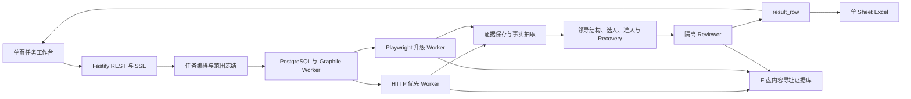

# 爬虫网站单地区、单机构真实纵向闭环设计规格

> 创建日期：2026-08-03  
> 当前状态：详细规格已获用户批准，等待 Claude Code 编写实施计划  
> 项目目录：`E:\Stellaris`  
> 批准依据：开发期决策日志 R-03、R-04  
> 用途：作为 Claude Code 后续编写实施计划的设计输入；本文不是实施计划，不授权修改代码

## 1. 目标

下一阶段不追求全国范围、完整 UI 或所有 Worker 同时完工，而是先交付一个可验证的真实纵向闭环：用户提交一个行政区和一个机构，系统从任务冻结开始，完成抓取、证据保存、事实抽取、规则判断、Recovery、隔离 Reviewer、结果入库、网页展示和单 Sheet Excel 导出。

该闭环必须证明三件事：

1. 业务规则能够由纯 TypeScript 和声明式规则稳定执行，不依赖大模型页面判断。
2. 每个最终 URL 或空 URL 都能追溯到真实网络事件、不可变证据、规则版本和 Reviewer 决策。
3. 同一份已复核 `result_row` 能同时驱动网页结果和 Excel，不形成两套结论。

## 2. 权威来源顺序

规划和开发按下列顺序解释要求：

1. 用户最新明确指令与 `2026-08-03-crawler-implementation-decision-log.md` 中的开发期决议。
2. `2026-07-30-official-biography-crawler-design.md` 冻结业务规格。
3. `2026-07-30-official-biography-crawler-decision-log.md` 中已批准的产品与技术决议。
4. 19 个项目 Skill、知识视图和证据卡，用于诊断、评审、版本用法与计划质量，不作为生产运行时规则。
5. 当前代码和本机环境事实；代码现状只能说明“现在有什么”，不能自行覆盖已批准要求。

发生冲突时不得静默选择。只有用户最新明确决议可以覆盖旧基线，覆盖关系必须追加到开发期决策日志。

## 3. 当前现场基线

截至 2026-08-03 的只读核验结果：

- pnpm workspace、8 个工作区和锁文件已经存在。
- `pnpm typecheck` 通过。
- `pnpm test` 失败，直接原因是 `apps/` 与 `packages/` 下没有任何测试文件。
- Web 仅渲染标题；Backend 仅提供 `/health`。
- `crawler`、`rules`、`evidence`、`exporter` 仍为包骨架。
- `contracts` 已有健康合同和业务枚举，但缺任务、SSE、证据、结果与导出边界合同。
- `db` 已定义 25 张表、初始迁移和三个 Repository，但尚未在当前环境完成可验证的真实迁移；多项跨表业务不变量尚未由外键、约束或事务服务强制。
- `config/rules`、`config/site-adapters`、`infra/docker`、`infra/squid` 为空目录。
- `E:\StellarisData\postgres` 已创建但为空；Docker daemon 当前未运行。
- 当前实现依赖版本与 2026-07-30 冻结规格部分不同，后续规划必须先完成版本基线对账并将获准结论写入开发期决策日志。

这些事实是规划输入，不表示当前阶段已具备可运行爬虫。

## 4. 纵向闭环范围

### 4.1 输入

第一闭环采用“指定机构或人员模式”的收敛子集：

- 一个行政区划代码与中文名称；
- 一个机构正式名称；
- 可选人员姓名，只用于缩小目标，不允许跳过完整领导结构、URL 准入或 Reviewer；
- 一个经过官方身份验证的机构入口 URL，或由受控发现阶段得到的入口；
- 客户端幂等键；
- 冻结规则版本。

设计不绑定某个固定真实网站。离线验收使用固定金标证据；真实官网 Canary 目标在执行时由用户明确授权并通过安全出口访问。

### 4.2 输出

- 一个完整 `task_run` 及其中文状态；
- 一个冻结 `target_scope`；
- 一个冻结 `institution_snapshot`，失败时也保留终态；
- 完整领导结构和两名主要自然人槽位；
- 每个槽位一个 `result_row`；
- 合格 URL 或空 URL＋中文终态原因；
- 可查看的网络、页面、规则与 Reviewer 证据链；
- 一个仅含一个 Sheet 的 `.xlsx`，内容由 `result_row` 投影生成。

### 4.3 本阶段暂缓

以下能力保留在首版总设计中，但不阻塞第一闭环：

- 多行政区批量选择和上传名单；
- 自动展开全部下级行政区；
- 完整机构库存批量发现；
- 大规模并发、跨域性能目标和长期站点画像学习；
- 面向完整任务的暂停、继续、取消和容器重启恢复；
- 完整管理页面、登录、团队、角色、定时任务和 SaaS 能力。

暂缓不等于删除。后续扩展不得破坏第一闭环已经固定的数据合同和证据链。

## 5. 架构

采用模块化单体代码仓库、独立 Worker 进程和 PostgreSQL 持久队列。首阶段不增加 Redis、Kafka、GraphQL、WebSocket、微服务或 Kubernetes。

## 6. 模块边界

### 6.1 `packages/contracts`

作为 Web、API、Worker、规则、数据库输入和导出器之间的唯一边界合同来源。第一闭环至少补齐：

- 创建任务请求与响应；
- 任务详情和中文状态；
- 目标范围、机构快照和两槽位结果；
- SSE 事件联合类型；
- 证据摘要与证据详情；
- Excel 导出状态；
- 所有 API 使用的 TypeBox Schema 与静态类型。

### 6.2 `packages/db`

第一闭环使用现有 25 表模型，但实施计划必须先审计并补齐：

- 关键外键和删除策略；
- 任务、机构、槽位、Reviewer 和结果的一致性约束；
- 非空 `result_row.position_url` 与通过 Reviewer 决策之间的事务级不变量；
- 空 URL 对应中文终态原因；
- 任务创建、范围冻结和机构冻结的原子提交；
- 查询路径所需索引；
- PostgreSQL `bigint`、`numeric` 与 TypeScript 类型映射。

### 6.3 `packages/evidence`

实现 `E:\StellarisData\evidence` 下的内容寻址存储：

- 流式 SHA-256；
- 临时文件写入、刷新和原子改名；
- 相对路径入库，不把任意绝对路径写进业务表；
- 相同哈希去重但保留多次网络事件引用；
- HTML、JSON、响应头、截图和 Reviewer 复抓证据的元数据；
- 完整性检查只读入口。

### 6.4 `packages/crawler`

- URL 身份、规范化、范围与预算；
- SSRF 防护与逐跳重定向复核；
- CheerioCrawler HTTP 优先；
- 只在明确升级条件成立时使用 Playwright；
- 公开 XHR/Fetch 只作为页面事实来源，不绕过访问控制；
- 网络事件和页面快照先落证据，再进入事实与规则层。

### 6.5 `packages/rules`

- 页面事实标准化；
- 完整领导结构组装；
- 按机构类型选择 `PRIMARY_1`、`PRIMARY_2`；
- 当前性证据图；
- 五类允许页面判型；
- 九项最终 URL 硬门槛；
- Recovery 触发、预算和顺序；
- Reviewer 六方面独立一致性判断。

任何发现分数只决定抓取优先级，不能抵消硬门槛失败。

### 6.6 `apps/backend`

- 组合依赖和 Repository；
- 创建任务、查询任务、查询结果和导出 API；
- SSE 只传递服务端事实，不由浏览器推算任务状态；
- API 进程不直接执行重型抓取；
- Worker 入口按 HTTP、浏览器、规则、Reviewer 和导出职责拆分。

### 6.7 `apps/web`

第一闭环只需要三部分：

1. 指定行政区和机构的任务表单；
2. 真实任务阶段、计数、失败和恢复状态；
3. 两槽位结果表、证据抽屉和 Excel 下载。

用户可见位置只显示中文状态和结论，不显示内部槽位、枚举和诊断字段。

### 6.8 `packages/exporter`

- 只读取已复核 `result_row`；
- 唯一 Sheet；
- 中文表头和可点击岗位信息 URL；
- 空 URL 保持空白；
- 不输出内部分析、Reviewer 中间状态或槽位标记；
- 保存导出文件哈希、行数和生成时间。

## 7. 数据流与事务边界

1. API 校验任务输入和幂等键。
2. 同一事务创建 `task_run`、`target_scope` 和 `institution_snapshot`。
3. 编排器提交唯一抓取作业；重复请求不产生第二个业务任务。
4. HTTP Worker 执行安全解析、请求和逐跳校验，先保存网络事件与不可变文档证据。
5. 只有 HTTP 事实不足且升级条件成立时，才创建 Playwright 作业。
6. 事实抽取只消费已经保存的文档快照，不直接依赖瞬时页面对象。
7. 规则层形成完整领导结构、角色和两个槽位，再生成候选 URL 池。
8. 候选必须通过五类页面判型与九项硬门槛；失败进入 Recovery 或空 URL 路径。
9. Reviewer 使用不同请求唯一键独立复抓并重新计算六方面事实，不读取 Collector 的结论字段。
10. 只有 Reviewer 一致时，事务写入非空最终 URL；冲突无法恢复时写空 URL 和中文原因。
11. `result_row` 提交后产生 SSE 结果事件，并作为网页和 Excel 的唯一数据源。

## 8. 失败与恢复语义

- DNS、TLS、连接和短暂服务错误：按请求级重试预算处理，耗尽后进入 Recovery 或终态。
- `403`、`429`、验证码、登录、WAF 或 robots 禁止：标记外部限制，降速、等待、跳过或终止；不提供绕过方案。
- 证据文件写入、哈希或原子改名失败：不得继续形成事实或最终结论。
- 页面事实不足：允许按已批准顺序升级浏览器、补充官方入口或受控搜索发现。
- 无完整领导结构：不直接选人，记录未确认状态。
- 无合格候选 URL：最终 URL 留空，不用新闻、栏目首页或搜索摘要补位。
- Reviewer 冲突：记录冲突证据，按预算触发 Recovery；仍冲突则 URL 留空。
- Worker 崩溃：依靠持久作业和幂等键重新领取，已提交的不可变证据不覆盖、不重复写入。

## 9. 安全边界

在任何真实官网 Canary 前必须具备：

- 仅允许 `http` 和 `https`；
- DNS 解析、私网/环回/链路本地/保留地址拒绝；
- 每次重定向重新校验 URL、DNS 和 IP；
- HTTP 与浏览器流量不能绕过统一安全出口；
- 请求、响应、日志、SSE 和证据展示统一脱敏；
- 响应大小、页面数、重定向数、浏览器页面数和任务时长上限；
- 不登录、不解验证码、不绕过访问控制或 WAF；
- 只采集公开官方页面，不扩大到新闻、媒体、百科或非公开数据。

## 10. 测试与验证

实施计划必须按测试驱动开发组织。当前“零测试文件”是第一优先级缺口，不能用 `--passWithNoTests` 掩盖。

第一闭环至少包含：

- 合同测试：TypeBox Schema 与 TypeScript 类型一致；
- 数据库集成测试：真实 PostgreSQL 18 容器、迁移、约束、事务和幂等；
- 证据存储测试：哈希、去重、原子提交、损坏检测；
- URL 与安全属性测试：规范化、重定向、DNS/IP 阻断和预算；
- 固定 HTML/JSON 回放：页面事实、领导结构、两槽位、当前性、硬门槛；
- Recovery 与 Reviewer 隔离测试；
- API 与 SSE 组件测试；
- Web 任务和证据展示测试；
- Excel 单 Sheet、中文字段、超链接和空 URL 测试；
- 一个离线端到端金标闭环；
- 经用户单独授权后执行一个真实官网 Canary。

验收命令至少包括 `pnpm typecheck`、`pnpm test`、`pnpm build`、Docker Compose 配置校验、数据库迁移验证和离线端到端回放。任何命令失败都不得声明阶段完成。

## 11. 第一闭环完成标准

- 从 Web 或 API 创建一个指定机构任务，重复提交幂等。
- 任务范围、机构、规则版本和网络事实均持久化。
- HTTP 优先与 Playwright 升级条件可由测试证明。
- 原始响应和 Reviewer 复抓均有独立证据和请求唯一键。
- 完整领导结构先于两人选择产生。
- 两个槽位各有唯一 `result_row`。
- 非空 URL 同时满足官方性、允许页面类型、人员、机构、正式岗位、当前性、优先入口检查、Reviewer 一致和无禁止信号。
- 不满足时 URL 留空并显示中文原因。
- 网页和 Excel 从同一 `result_row` 生成且内容一致。
- SSE 能在结果提交后推送真实状态和新增结果。
- 所有自动化测试、类型检查、构建、迁移和离线回放通过。
- 未执行未经批准的真实抓取、访问控制绕过或破坏性数据操作。

## 12. 后续扩展顺序

第一闭环验收后依次扩展：

1. 多机构与完整机构库存；
2. 多行政区、下级展开和上传名单；
3. 暂停、继续、取消、失败重试和容器重启恢复；
4. 全局与单主机并发、缓存、站点画像和搜索提供器；
5. 30 秒首批复核结果与 100—500 已知候选页 P95 60 秒性能门槛；
6. 完整安全、可观测性、金标、Live Canary 和性能回归体系。

## 13. 决议记录规则

- 新的用户明确决议追加到开发期决策日志，连续编号，不覆盖历史。
- 设计推导、扫描发现和建议保留在规格或评审报告，不标记为用户批准决议。
- 决议改变本文时，在本文末追加修订记录并说明对应 `R-xx`。
- Claude Code 规划或开发发现必须偏离本文时，先输出冲突与影响，等待用户决议落盘后再实施。

## 14. 修订记录

- 2026-08-03：依据用户批准的 R-03 创建第一版；记录 R-04 的本地决议持久化要求。详细规格等待用户复核。
- 2026-08-03：用户批准详细规格（R-05）；状态更新为等待 Claude Code 编写实施计划，计划批准前不授权开发。
